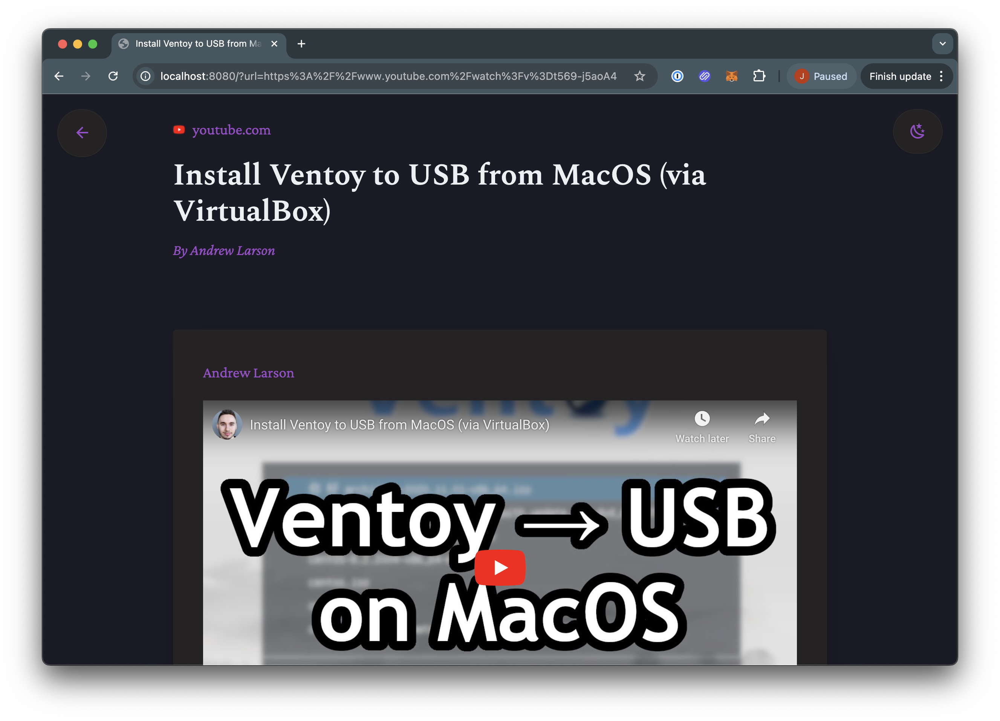

## 📖 Reader

Reader is a simple self-hosted application that takes in a URL and converts it into reader-mode friendly content using the [postlight parser](https://github.com/postlight/parser). Reader includes an API to programmatically access reader mode content and makes a great content proxy for local LLMs and SearXNG.

## ⭐️ Features

- 🔗 Supports any URL
- 🎥 Automatically convert some URLs to interactive embeds (YouTube, Vimeo, TikTok, etc.)
- 😎 Easy on both human and LLM eyes
- 🔖 Bookmarklet for one-click sanization
- 🔌 API to programmatically access reader mode content
- 🔌 Plugin framework for oEmbed providers
- ☀️ Light and 🌙 Dark themes

## Coming Soon

- 🔍 SearXNG plugin that redirects search results to Reader.
- 📰 FreshRSS plugin that converts feed item bodies with reader mode versions of the items' URLs.

## 📸 Screenshots

### Article View


### Embed View



## 🐳 Docker Compose

```yaml
---
services:
  reader:
    image: ghcr.io/joestump/reader:latest
    container_name: reader
    environment:
      - PORT=8080 # Port to run on
      - HOST=0.0.0.0 # Address to listen on
      - PROXY_IMAGES=true # Whether to proxy article images
    ports:
      - 8080:8080
    healthcheck:
      # Remember to update the healthcheck URL if you change the port
      test: ["CMD", "wget", "--quiet", "-O", "/dev/null", "http://localhost:8080"]
      interval: 30s
      timeout: 10s
      retries: 5
    restart: unless-stopped
```

## 🔌 API

Reader offers a simple API endpoint for programmatically accessing sanitized content from other applications. For instance, replacing content in your RSS feeds with a FreshRSS plugin or redirecting news sites to Reader from SearXNG results.

### `/content.json`

Returns a parsed version of the article in JSON format.

#### Request Parameters

| Parameter | Type   | Required | Description                                    |
|-----------|--------|----------|------------------------------------------------|
| `url`     | string | Yes      | The URL of the article you want to parse       |

#### Response Object

| Field            | Type   | Description                                          |
|-----------------|--------|------------------------------------------------------|
| `title`         | string | The article's title                                  |
| `content`       | string | The article's sanitized HTML content                 |
| `markdown`      | string | The article's content in Markdown format             |
| `domain`        | string | The website's domain without "www."                  |
| `root`          | string | The website's root URL                               |
| `date_published`| string | Publication date in readable format                  |
| `favicon`       | string | Data URL for the generated favicon                   |
| `oembed_data`   | object | Raw oEmbed data if available (YouTube, Vimeo, etc.) |

#### Example Request

```bash
curl -s "http://localhost:8080/content.json?url=http://vimeo.com/8708708" | jq
```

## 🛠️ Development

- `npm i`
- `node run dev`
